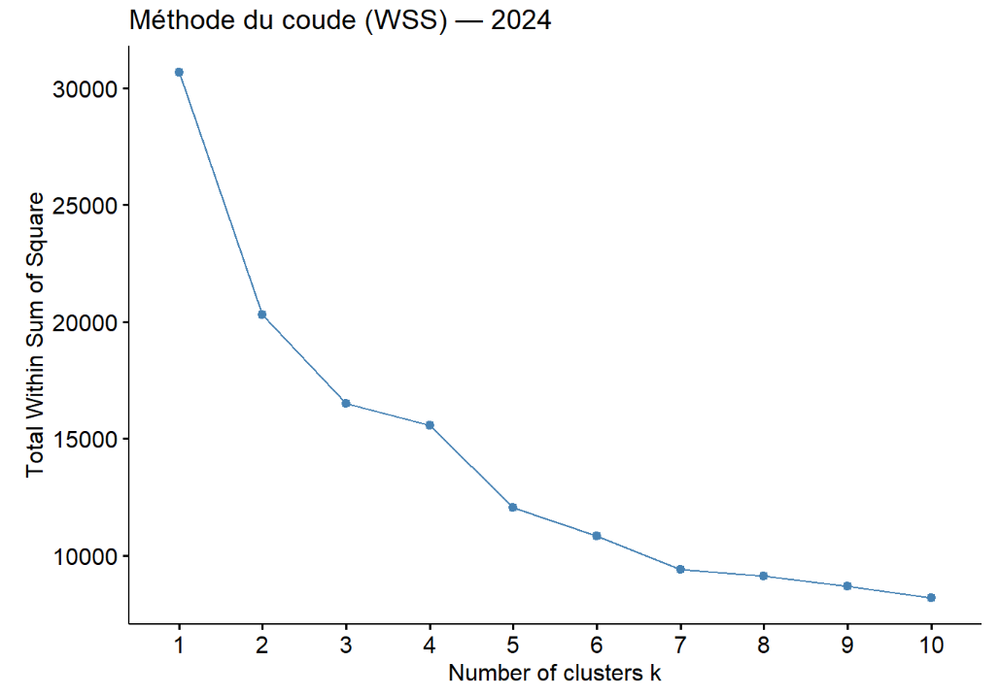
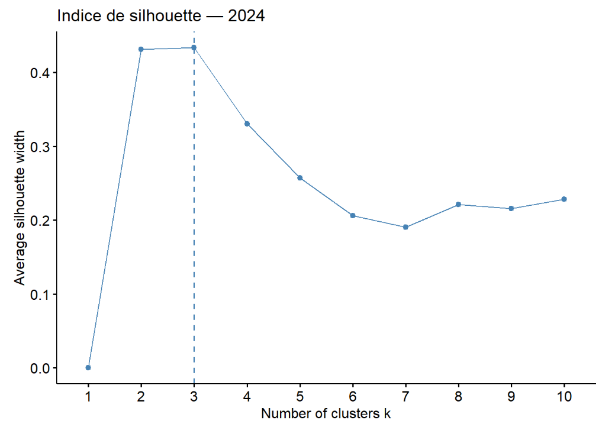
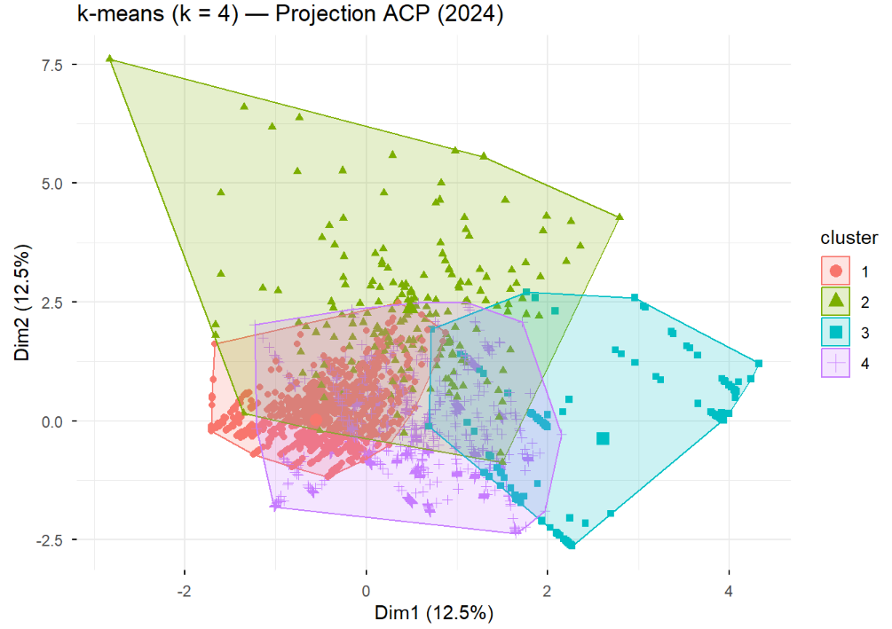
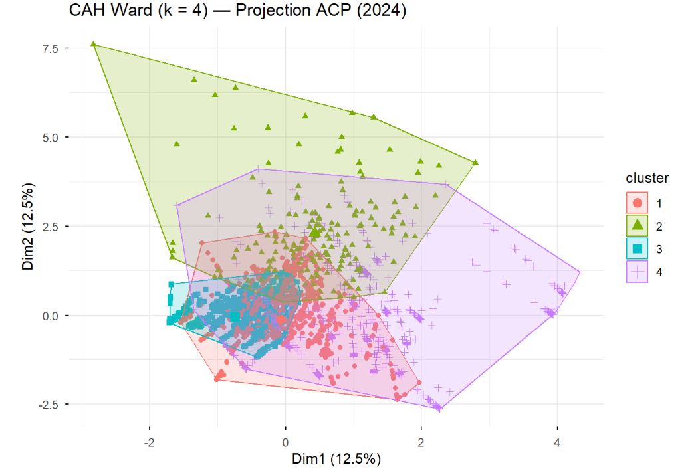
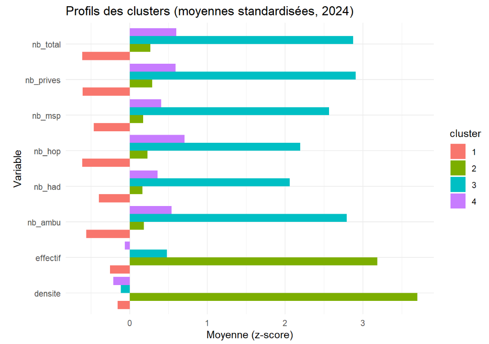

\vspace*{\fill}
\begin{abstract}
Cette étude propose une analyse approfondie de la structure territoriale de l'offre de soins en France, en s'appuyant sur les données exhaustives des bases AMELI et FINESS. Ce travail s'inscrit dans le prolongement de notre participation au Challenge Open Data University, au cours duquel une première phase de visualisation a permis d'explorer les disparités régionales au travers d'un dashboard. 
  L'objectif de ce document est de dépasser le stade descriptif pour caractériser, par des méthodes de statistique multivariée, les dynamiques structurelles qui régissent le système de santé français à l'échelle départementale. Nous mobilisons pour cela une approche complémentaire : une Analyse en Composantes Principales (ACP) et une Analyse des Correspondances Multiples (ACM) pour comparer l'évolution des structures démographiques (vieillissement, féminisation) et des volumes de soins entre 2010 et 2024. Parallèlement, une Analyse Factorielle des Correspondances (AFC) et une classification (Clustering) permettent d'identifier des typologies de territoires et de mettre en lumière les spécialisations médicales propres à certains bassins de population.
  Les résultats mettent en évidence une structuration de l'offre de soins de plus en plus influencée par les enjeux du renouvellement générationnel des praticiens, révélant ainsi des disparités territoriales croissantes dans l'accès aux soins.
\end{abstract}
\vspace*{\fill}

\newpage
\tableofcontents
\newpage

```{r setup, include=FALSE}
knitr::opts_chunk$set(echo = FALSE, warning = FALSE, message = FALSE)
```

```{r chargement des données}
#Finess
source("Script/00_finess.R")

#Ameli
source("Script/00_ameli_effectif.R")


```

\newpage

# Introduction

## Contexte et objectifs

L'analyse de l'offre de soins constitue un enjeu majeur pour les politiques publiques. La répartition territorial des professionnels de santé ainsi que l'évolution de leur caractéristiques démographiques sont des éléments essentiels pour anticiper les besoins futurs et orienter en conséquence les politiques d'aménagement sanitaire du territoire.

Cette étude propose une analyse de l'offre de soins à l'échelle départementale, en mobilisant plusieurs approches complémentaires : 

- **L'Analyse en Composantes Principales (ACP)**, qui permet d'étudier les relations entre variables quantitatives continues décrivant le volume et la structure démographique de l'offre
- **L'Analyse des Correspondances Multiples (ACM)**, qui propose une typologie qualitative des territoires à partir de variables catégorielles construites par discrétisation
- **L'analyse Factorielles des Correspondances (AFC)**, qui permet d'aalyser les relations entre les professions de santé et les territoires afin d'identifier les profils de spécialisation rt les oppositions structurelles entre départements.
- **Le clustering**, qui permet de regrouper les territoires en classes homogènes sur la base des dimensions factorielles, en vue de construire une typologie synthétique de l’offre de soins.

## Objectifs de l'analyse

L’objectif principal de cette étude est de caractériser la structure territoriale de l’offre de soins en France à l’échelle départementale, et d’en analyser l’évolution entre 2010 et 2024. Il s’agit de dépasser une lecture descriptive des effectifs pour mettre en évidence les dimensions latentes qui organisent les disparités spatiales, en combinant des indicateurs de volume, de structure démographique des professionnels (féminisation, vieillissement) et de structuration des établissements de santé.

Plus spécifiquement, l’analyse poursuit quatre objectifs complémentaires :

1. **Identifier les principaux axes de différenciation entre départements** à partir d’indicateurs quantitatifs synthétiques (niveau global d’offre, structuration en établissements, profil démographique des professionnels), afin de dégager les grandes logiques d’organisation de l’offre de soins.

2. **Comparer la structure de l’offre de soins entre 2010 et 2024** en évaluant la stabilité ou la transformation des gradients territoriaux, notamment l’importance relative des enjeux de volume versus les enjeux de renouvellement générationnel.

3. **Mettre en évidence les associations entre professions de santé et territoires** afin d’identifier des profils de spécialisation (territoires plus “généralistes” vs plus “spécialisés”) et d’éclairer les oppositions structurelles entre départements.

4. **Construire une typologie synthétique des départements** par une classification non supervisée, permettant de regrouper les territoires en classes homogènes et de fournir une lecture opérationnelle des inégalités territoriales de l’offre de soins.

Au final, l’objectif est de produire une représentation lisible et interprétable des disparités départementales, susceptible d’éclairer les enjeux d’aménagement sanitaire et d’anticipation des besoins de soins, en tenant compte simultanément de la quantité d’offre, de sa soutenabilité démographique et de sa spécialisation.

# Méthodologie

## Source de données

### Données AMELI - démographie des professionnels de santé

La base AMELI, issue du portail data.ameli.fr, constitue la source principale de cette étude. Elle fournit des informations détaillées sur les effectifs de professionnels de santé selon: 

- Le sexe
- La classe d'âge
- La profession
- Le département
- L'année

Ces données présentent une granularité départementale annuellement ce qui permet donc de construire des indicateurs démographiques synthétiques. 


```{r tableau_ameli, results='asis'}
source("Script/00_tab_pres_ameli.R")
tab1
rm(tab1)
```


### Données FINESS – établissements de santé

La base FINESS, issue de data.gouv.fr, recense les établissements sanitaires et médico-sociaux. Après fusion des informations administratives et géographiques, elle permet d'identifier la localisation départementale de chaque établissement.

Contrairement aux données AMELI, FINESS ne dispose pas d'une dimension temporelle homogène sur la période étudiée. Les informations issues de cette base sont donc considérées comme structurelles, c'est-à-dire constantes dans le temps.

```{r tableau_finess, results='asis'}
source("Script/00_tab_pres_finess.R")
tab1
rm(tab1)
```

## Nettoyage et harmonisation des données

### Traitement des données AMELI

Afin d'éviter les doublons et les agrégats non désirés et incompatibles avec notre analyse territoriale, plusieurs traitements ont été appliqués :

- Exclusion de la modalité "tout sexe" et "sexe inconnu"
- Exclusion des agrégats territoriaux "FRANCE" et "Tout département"
- Exclusion des classes d'âge "Tout âge" et "âge inconnu"
- Exclusion des regroupements de professions de type "Ensemble des..."

Ces opérations garantissent que chaque observation corresponde à un effectif réel, rattaché à une profession, un sexe, une classe d'age connu, un département et enfin une année. 

### Harmonisation des codes départementaux

La variable département qui a été utilisé pour la jointure issue de **FINESS** utilise des codes spécifiques pour certains territoires. Ces codes ont été recodés selon la nomenclature standard de l'INSEE : 

- 9A --> 971 (Guadeloupe)
- 9B --> 972 (Martinique)
- 9C --> 973 (Guyane)
- 9D --> 974 (La Réunion)
- 9E --> 975 (Saint-Pierre-et-Miquelon)
- 9F --> 976 (Mayotte)

## Construction des indicateurs pour l'ACP

L'ACP repose sur cinq variables quantitatives continues construire à partir des données, agrégées en couple département × année.

### Indicateurs de structure démographique

**Part des femmes**

La part des femmes est calculée comme le rapport entre l'effectif féminin et l'effectif total :

$$\text{part\_femmes} = \frac{\text{effectif femmes}}{\text{effectif total}}$$

**Part des professionnels de 60 ans et plus**

La part des 60 ans et plus est calculée à partir des classes d'âge 60-64 ans, 65-69 ans et 70 ans et plus :

$$\text{part\_60\_plus} = \frac{\text{effectif des 60 ans et plus}}{\text{effectif total}}$$

Cet indicateur constitue une mesure centrale du vieillissement de l'offre de soins et des enjeux de renouvellement démographique.

**Âge moyen estimé**

L'âge moyen est estimé par une moyenne pondérée des centres de classes d'âge, les pondérations étant les effectifs correspondants. Cette méthode est couramment utilisée lorsque l'âge individuel n'est pas disponible.

### Indicateurs de volume

**Effectif total de professionnels (transformation logarithmique)**

L'effectif total correspond à la somme des effectifs de professionnels de santé, toutes professions confondues, par département et par année. Afin de limiter l'influence des départements les plus peuplés dans l'ACP, une transformation logarithmique est appliquée :

$$\text{effectif\_total\_log} = \log(1 + \text{effectif\_total})$$
```{r tableau_acp, results='asis'}
source("Script/01_fusion_ACP.R")
source("Script/01_tab_pres_acp.R")
tab1
rm(tab1)
```


## Construction des variables pour l'ACM

L'ACM nécessite des variables qualitatives. Ces variables sont construites par **discrétisation en tertiles** des indicateurs quantitatifs précédents.

### Principes de discrétisation

Le choix de la discrétisation en tertiles repose sur plusieurs considérations :

- Absence de seuils clairement établis
- Volonté d'obtenir des modalités équilibrées en effectifs

**Important** : Les seuils sont calculés sur l'ensemble des observations (toutes années confondues), ce qui garantit une interprétation homogène dans le temps et permet des comparaisons inter-temporelles cohérentes.

### Variables qualitatives construites

**Niveau d'offre de soins**

La variable `niveau_offre` est construite à partir de l'effectif total de professionnels par département et par année. Trois modalités sont définies :

- **Faible** : départements situés dans le premier tertile
- **Moyen** : départements situés dans le deuxième tertile
- **Élevé** : départements situés dans le troisième tertile

Cette variable caractérise le niveau global de dotation en professionnels de santé.

**Féminisation de l'offre**

La variable `feminisation` repose sur la part des femmes parmi les professionnels de santé. Trois modalités sont retenues :

- **Faible** : départements avec une féminisation inférieure au premier tertile
- **Intermédiaire** : départements situés dans le deuxième tertile
- **Forte** : départements avec une féminisation supérieure au deuxième tertile

Cette variable permet de saisir les différences territoriales et temporelles dans la composition sexuée de l'offre de soins.

**Vieillissement de l'offre**

La variable `vieillissement` est construite à partir de la part des professionnels âgés de 60 ans et plus. Trois modalités sont définies :

- **Jeune** : départements avec une faible part de professionnels de 60 ans et plus
- **Intermédiaire** : départements situés dans le deuxième tertile
- **Vieillissante** : départements avec une forte part de professionnels de 60 ans et plus

Cette variable constitue un indicateur central pour analyser les enjeux de renouvellement de l'offre de soins.

### Équilibrage et validation

La discrétisation en tertiles conduit naturellement à un équilibre parfait des modalités sur l'ensemble de la base :

- Chaque modalité représente environ un tiers des observations
- Aucune modalité rare n'est observée
- Aucune variable constante n'est introduite

```{r tableau_acm, results='asis'}
source("Script/01_fusion_ACM.R")
source("Script/01_tab_pres_acm.R")
tab1
rm(tab1)
```

\newpage

# Analyse en Composantes Principales (ACP)

## Analyse comparative 2010 vs 2024

L'ACP a été réalisé sur 101 départements français pour chacune des deux années de référence (2010 et 2024) avec 5 variables quantitatives actives.
Les individus sont donc chacun des départements français. 

### Éboulis des valeurs propres

```{r acp_eboulis_vp, fig.width=10, fig.height=5, fig.align='center', out.width='100%'}
source("Script/02_acp_vp.R")
comparaison_eboulis
rm(comparaison_eboulis)
```

Les éboulis des valeurs propres montrent que les deux premières dimensions concentrent l'essentiel de l'information aussi bien en 2010 qu'en 2024.
En 20010, les deux premiers axes expliquent 80,8% de la variance totale, tandis qu'en 2024 cette proportion atteint 84,6%, indiquant une structure factorielle légèrement plus concentrée dans le temps. La forte décroissance observée après la deuxième dimension suggère que les axes suivants apportent une information marginale ce qui implique que l'analyse peut être raisonnablement limitée aux deux premiers axes pour l'interprétation des structures territoriales de l'offre de soins.

### Cercle des corrélations

```{r acp_cercle_corr, fig.width=10, fig.height=5, fig.align='center', out.width='100%'}
source("Script/02_acp_cercle.R")
graphique_final
rm(graphique_final)
```

L'analyse des cercles de corrélations met en évidence deux dimensions structurantes communes aux deux années étudiées, bien que leur positionnement sur les axes diffère.

En 2010, la première dimension est principalement associée aux variables de volume de l'offre de soins, notamment l'effectif total de professionnels de santé et le nombre d'établissements. Elle traduit un gradient opposant les départements fortement dotés ç ceux disposant d'une offre plus restreinte. La seconde dimension est davantage corrélée aux variables de structure démographique, en particulier l'âge moyen et la part des professionnels âgés de 60 ans et plus. 

En 2024, on observe une inversion des axes : les variables qui structuraient majoritairement la première dimension en 2010 contribuent davantage à la seconde, et inversement. Cette inversion ne correspond malgré cela pas à un changement de sens des axes mais à une rotation du plan factoriel, les axes de l'ACP étant définis indépendamment pour chaque année. Ainsi, la numérotation des dimensions n'est pas directement comparable dans le temps. 

Dans les deux cas, les mêmes dimensions latentes demeurent : 

- une dimension liée au volume global de l'offre de soin,
- une dimension liée à la structure démographique des professionnels.

En revanche, leur poids relatif dans l'explication de la variance évolue. En 2024, les variables d'âge et de vieillissement contribuent davantage à la structuration de l'espace factoriel, suggérant que les différences territoriales sont de plus en plus liées au profil démographique des professionnels de santé, et non plus uniquement à la quantité d'offre disponible.

### Contributions des variables aux dimensions 

```{r acp_contrib_dim1, fig.width=10, fig.height=5, fig.align='center', out.width='100%'}
source("Script/02_acp_contrib_dim1.R")
comparaison_contrib
rm(comparaison_contrib)
```

```{r acp_contrib_dim2, fig.width=10, fig.height=5, fig.align='center', out.width='100%'}
source("Script/02_acp_contrib_dim2.R")
comparaison_contrib
rm(comparaison_contrib)
```

L'analyse des contributions confirme cette lecture. La dimension associé au volume est principalement portée par l'effectif total et le nombre d'établissements, tandis que la dimension démographique est dominée par l'âge moyen et la part des professionnels de 60 ans et plus. 
La part des femmes contribue de manière plus modérée mais régulière, traduisant une feminisation progressive et relativement homogène de l'offre de soins sur l'ensemble du territoire. 

### Projection des individus 

```{r acp_individu, fig.width=10, fig.height=5, fig.align='center', out.width='100%'}
source("Script/02_acp_individu.R")
projection_comparee
rm(projection_comparee)
```

Les projections des départements sur le plan factoriel révèlent une forte dispersion selon la dimension de volume, mettant en évidence d'importantes inégalités territoriales en matière d'offre de soins. Certains départements se distinguent par des positions extrêmes, reflétant des situations atypiques de forte concentration ou de sous-dotation. 

Entre 2010 et 2024, la structure selon la dimension démographique devient plus visible, avec une différenciation accrue de certains territoires en fonction du vieillisement de leur offre de soins. Cette évolution confirme le rôle croissant des enjeux démographiques dans l'analyse territoriale de l'offre de soins.

## Conclusion synthétique de l'ACP

L'analyse en composantes principales met ainsi en évidence une structuration stable de l'offre de soins autour de deux dimensions fondamentales : **le volume et la structure démographique**, tout en soulignant une évolution notable de leur importance relative. Entre 2010 et 2024, le vieillisement des professionnels de santé apparaît comme un facteur de plus en plus discriminant entre les départements, au même titre que le niveau global de dotation.

\newpage 

# Analyse des Correspondances Multiples (ACM)

## Analyse comparative 2010 vs 2024

Comme précédement, l'ACM a été réalisée sur 101 départements français pour chacune des deux années de références (2010 et 2024), avec 3 variables qualitatives actives (9 modalités au total).

### Éboulis des valeurs propres 

```{r acm_eboulis_vp, fig.width=10, fig.height=5, fig.align='center', out.width='100%'}
source("Script/03_acm_vp.R")
acm_eboulis_compare
rm(acm_eboulis_compare)
```

Les éboulis des valeurs propres montrent que, pour les deux années étudiées, les premières dimensions expliquent une part substantielle de l'inertie totale. En 2010, les deux premiers axes cumulent environ 41,5% de l'intertie, tandis qu'en 2024 cette proportion atteint 47,5%, traduisant une structuration légèrement plus marquée des profils départementaux dans le temps. 

Comme c'est fréquemment le cas en ACM, l'intertie est plus diffuse que dans une ACP, ce qui justifie une interprétation prudente et principalement sur les deux premières dimensions.

### Interprétation des axes et plan factoriel

```{r acm_variable, fig.width=10, fig.height=5, fig.align='center', out.width='100%'}
source("Script/03_acm_variable.R")
comparaison_acm
rm(comparaison_acm)
```

L'analyse des modalités projetées sur le plan factoriel met en évidence des structures comparables entre 2010 et 2024, bien que leur positionnement sur les axes diffère.

En 2010, la première dimension oppose principalement les départements caractérisés par une offre de soins faible et une structure vieillisante à ceux disposant d'une offre plus élevée et d'un profil plus favorable. La seconde dimension est davantage structurée par la féminisation de l'offre, opposant des territoires faiblement féminisés à ceux où la part des femmes est plus importante. 

En 2024, on observe une réorganisation du plan factoriel : certaines modalités qui structuraient principalement la première dimension en 2010 contribuent davantage à la seconde, et inversement. Cette évolution ne doit pas être interprétée comme une inversion de sens des axes, mais comme précédemment par une rotation du repère factoriel, les axes étant définis indépendamment pour chaque année. 

Dans les deux cas, les dimensions interprétatives restent similaires : 

- une dimension liée à la dotation globale en offre de soins,
- une dimension liée à la structure démographique, en particulier au vieillisement et à la féminisation.

La différence observée entre 2010 et 2024 traduit une évolution du poids relatif de ces dimensions dans la structuration des territoires. 

### Contributions des modalités

```{r acm_contrib_dim1, fig.width=10, fig.height=5, fig.align='center', out.width='100%'}
source("Script/03_acm_contrib_dim1.R")
acm_contrib1_compare
rm(acm_contrib1_compare)
```

```{r acm_contrib_dim2, fig.width=10, fig.height=5, fig.align='center', out.width='100%'}
source("Script/03_acm_contrib_dim2.R")
acm_contrib2_compare
rm(acm_contrib2_compare)
```


L'analyse des contributions confirme cette lecture. Les modalités associées à une offre élevée et à un vieillissement marqué contribuent fortement aux axes principaux, traduisant leur rôle structurant dans la différenciation des départements. 

En 2024, les modalités liées au vieillissement de l'offre apparaissent plus contributives qu'en 2010, ce qui suggère une montée en importance de cet enjeu dans la typologie territoriale. La féminisation, bien que présente sur les deux dimensions, joue un rôle plus transveral et moins discriminant.

### Projection des individus

```{r acm_individu, fig.width=10, fig.height=5, fig.align='center', out.width='100%'}
source("Script/03_acm_individu.R")
acm_ind_compare
rm(acm_ind_compare)
```

La projection des départements sur le plan factoriel met en évidence une structuration nette selon les profils qualitatifs définis. Certains se distinguent par des positions extrèmes, reflètant des configurations spécifiques combinant faible niveau d'offre, vieillissement prononcé ou, à l'inverse forte dotation et structure plus favorable. 

Entre 2010 et 2024, la dispersion des individus selon les dimensions liées au vieillissement devient plus marquée, suggèrant une différenciation accrue des territoires face aux enjeux de renouvellement de l'offre de soins. 

## Conclusion de l'ACM

L'ACM met ainsi en évidence une typologie territoriale relativement stable de l'offre de soins, structurée autour du niveau de dotation et de la structure démographique des professionnels. Toutefois, la comparaison temporelle souligne une montée en improtance des modalités liées au vieillissement entre 2010 et 2024, confirmant les résultats obtenus par l'ACP et renforçant l'idée d'un enjeu démographique central dans l'évolution de l'offre de soins en France. 

\newpage


<!-- section kubra --->

```{r libraries}
library(readr)
library(FactoMineR)
library(factoextra)
library(knitr)
library(ggpubr)
library(gridExtra)
library(ggplot2)
library(ggrepel)
library(stringr)
```

\section{Analyse factorielle des correspondances (AFC)}

\subsection{Cadre général de l'analyse}

\subsubsection{Contexte et données utilisées}


```{r afc_run, include=FALSE}
base <- read_csv("data/base_afc.csv")
base <- as.data.frame(base)

rownames(base) <- base[,1]
base <- base[,-1]

# on garde un objet "tab_afc" pour réutiliser les noms de professions
tab_afc <- base %>% mutate(across(everything(), as.numeric))

res.afc <- CA(tab_afc, graph = FALSE)
```

L’analyse factorielle des correspondances est réalisée à partir d’un tableau de contingence construit à partir des données départementales sur les professionnels de santé en France. 
Dans ce tableau, les lignes correspondent aux différentes professions de santé et les colonnes représentent les départements français (métropole et outre-mer).

Chaque cellule du tableau indique l’effectif de professionnels exerçant une profession donnée dans un département donné. 
Autrement dit, la base décrit comment chaque profession médicale ou paramédicale est répartie sur l’ensemble du territoire.

La base contient au total 38 professions de santé (médecins généralistes, médecins spécialistes, infirmiers, psychiatres, sages-femmes, chirurgiens-dentistes, auxiliaires médicaux, etc.) et 101 départements. 
Elle permet donc d’analyser finement la structure territoriale de l’offre de soins.

Ce type de tableau est particulièrement adapté à l’Analyse Factorielle des Correspondances, car il permet d’étudier simultanément les profils des professions (lignes) et les profils des départements (colonnes), et de mettre en évidence les associations entre certaines spécialités médicales et certains territoires.


\subsubsection{Objectif de l’analyse}

L’objectif de cette Analyse Factorielle des Correspondances est de mettre en évidence les grandes oppositions territoriales dans la répartition des professionnels de santé en France. 
Il s’agit d’identifier quels départements se caractérisent par des profils spécifiques de professions médicales, et quelles professions sont particulièrement concentrées dans certains types de territoires.

L’AFC permet ainsi de dégager des profils de départements (urbains, ruraux, outre-mer, etc.) et de comprendre comment la structure de l’offre de soins varie selon les territoires.


\subsubsection{Justification du choix de la méthode}

L’Analyse Factorielle des Correspondances est particulièrement adaptée aux données utilisées, car celles-ci prennent la forme d’un tableau de contingence croisant deux variables qualitatives : les professions de santé et les départements.

L’AFC permet d’analyser l’écart à l’indépendance entre ces deux dimensions et de représenter, dans un espace de faible dimension, les relations entre les territoires et les professions. 
Elle offre ainsi une lecture synthétique des inégalités spatiales dans la répartition de l’offre de soins.

\newpage

\subsection{Résultat de l'AFC}

\subsubsection{Étude des inerties et choix du nombre d’axes}

L’étude des inerties permet d’évaluer la part d’information expliquée par chaque axe factoriel issu de l’AFC.  
Chaque axe est associé à une valeur propre, qui mesure la quantité de variance (ou d’inertie) expliquée par cet axe.

L’analyse des valeurs propres montre que la première dimension concentre l’essentiel de l’information contenue dans le tableau, tandis que la deuxième dimension apporte un complément d’information significatif.  
À elles deux, les deux premières dimensions expliquent une part majoritaire de l’inertie totale, ce qui justifie l’utilisation du plan factoriel (Dim 1, Dim 2) pour interpréter la structure des données.

Les axes suivants présentent des contributions nettement plus faibles et apportent peu d’information supplémentaire.  
Ils ne seront donc pas interprétés dans la suite de l’analyse, afin de conserver une représentation lisible et synthétique.


```{r fig1, fig.cap="Pourcentage d’inertie expliqué par les dimensions de l’AFC"}
print(
  fviz_screeplot(res.afc, addlabels = TRUE) +
    ggplot2::labs(title = "Pourcentage d'inertie expliqué par les dimensions") +
    ggplot2::coord_cartesian(ylim = c(0, 70))
)

```

Le graphique présente la part d’inertie expliquée par chaque dimension issue de l’Analyse Factorielle des Correspondances. 
On observe que la première dimension concentre à elle seule une part très importante de l’information, avec \textbf{65,2\%} de l’inertie totale. 
La deuxième dimension apporte un complément d’information significatif, avec \textbf{13,3\%}. 
À elles deux, les deux premières dimensions expliquent donc \textbf{78,5\%} de l’inertie totale, ce qui indique que l’essentiel de la structure du tableau est correctement résumé sur le plan factoriel (Dim 1, Dim 2).


Les dimensions suivantes contribuent beaucoup plus faiblement à l’explication de l’inertie (6,5\% pour la dimension 3, puis moins de 3\% pour les suivantes), ce qui montre que leur apport informationnel est limité. 
Il est donc pertinent de concentrer l’analyse sur les deux premières dimensions, qui capturent la majeure partie des différences structurelles entre les départements et les professions de santé.


\subsubsection{Interprétation du nuage des professions (plan 1–2)}


```{r fig_professions, fig.cap="AFC – Top 20 des professions les plus représentatives sur le plan (Dim 1, Dim 2)"}
print(
  {
    contrib_total <- rowSums(res.afc$row$contrib[, 1:2])

    top20_id   <- order(contrib_total, decreasing = TRUE)[1:20]
    top20_nom  <- rownames(tab_afc)[top20_id]

    row_ca <- get_ca_row(res.afc)
    df_top20 <- data.frame(
      nom     = top20_nom,
      Dim1    = row_ca$coord[top20_id, 1],
      Dim2    = row_ca$coord[top20_id, 2],
      contrib = contrib_total[top20_id]
    )

    df_top20$groupe_contrib <- cut(
      df_top20$contrib,
      breaks = quantile(df_top20$contrib, probs = c(0, 1/3, 2/3, 1)),
      include.lowest = TRUE,
      labels = c("Faible", "Moyenne", "Forte")
    )

    ggplot(df_top20, aes(x = Dim1, y = Dim2)) +
      geom_hline(yintercept = 0, linetype = "dashed", linewidth = 0.3) +
      geom_vline(xintercept = 0, linetype = "dashed", linewidth = 0.3) +
      geom_point(aes(color = groupe_contrib, size = groupe_contrib)) +
      geom_text_repel(aes(label = nom, color = groupe_contrib),
                      max.overlaps = 30, size = 3) +
      scale_color_manual(
        name = "Contribution",
        values = c("Faible"  = "#85b9d4",
                   "Moyenne" = "#1F78B4",
                   "Forte"   = "#E31A1C")
      ) +
      scale_size_manual(
        name   = "Contribution",
        values = c("Faible" = 2.5, "Moyenne" = 4, "Forte" = 6)
      ) +
      labs(
        title = "AFC – Top 20 professions les plus représentatives (plan 1–2)",
        x = "Dim1 (65,2%)",
        y = "Dim2 (13,3%)"
      ) +
      theme_minimal(base_size = 13) +
      theme(
        plot.title = element_text(hjust = 0.5, face = "bold"),
        legend.position = "right"
      )
  }
)
```
Le nuage des professions projeté sur le plan factoriel (Dim 1, Dim 2) permet d’analyser la structure territoriale de l’offre de soins en France à travers les profils des différentes professions de santé.

La dimension 1, qui explique 65,2 \% de l’inertie totale, constitue l’axe principal de différenciation. Elle oppose nettement, à droite du graphique, des professions fortement représentées dans la majorité des départements et typiques des territoires densément dotés en offre de soins, comme les infirmiers, les auxiliaires médicaux, les sages-femmes et les chirurgiens-dentistes, à des professions situées à gauche, caractérisées par une répartition plus spécifique et plus concentrée géographiquement, comme les psychiatres, les dermatologues ou certaines catégories de médecins spécialistes. Cet axe peut ainsi être interprété comme une opposition entre une offre de soins généraliste et diffuse et une offre plus spécialisée et territorialisée.

La dimension 2, qui explique 13,3 \% de l’inertie, apporte une différenciation complémentaire entre types de spécialisation médicale. Elle oppose notamment certaines professions médicales positionnées en haut du plan à d’autres situées en bas, ce qui traduit des profils territoriaux distincts, par exemple entre des activités médicales orientées vers le suivi général de la population et des activités plus techniques ou hospitalières.

La contribution des professions, représentée par la couleur et la taille des points, montre que certaines professions jouent un rôle structurant dans la construction du plan factoriel. Les professions en rouge, telles que les psychiatres, les infirmiers ou les auxiliaires médicaux, sont celles qui expliquent le plus la structure des axes. Leur position éloignée de l’origine indique qu’elles sont fortement associées à des types spécifiques de territoires.

En particulier, la position très isolée des psychiatres sur le graphique révèle un profil territorial atypique. Cela signifie que la répartition géographique des psychiatres diffère fortement de celle des autres professions de santé, ce qui suggère une concentration marquée dans certains départements, probablement les plus urbanisés ou spécialisés en santé mentale.

À l’inverse, les professions situées plus près de l’origine du plan factoriel présentent des profils territoriaux proches de la moyenne nationale. Elles contribuent peu à la différenciation des départements et sont réparties de manière relativement homogène sur le territoire.

Ainsi, le nuage des professions met en évidence une structuration claire de l’offre de soins entre des professions généralistes largement diffusées et des professions spécialisées fortement concentrées dans certains types de territoires, ce qui reflète les inégalités spatiales de l’accès aux soins en France.


\newpage 

\subsubsection{Contributions des professions aux dimensions 1 et 2}

```{r contrib_dim1, fig.cap="Contributions des professions à la dimension 1 (AFC)"}
print(
  fviz_contrib(res.afc, choice = "row", axes = 1, top = 15) +
    ggplot2::scale_x_discrete(labels = function(x) stringr::str_trunc(x, width = 20)) +
    ggplot2::labs(
      title = "Contribution des professions à la dimension 1",
      x = ""
    ) +
    ggplot2::theme_minimal(base_size = 14) +
    ggplot2::theme(
      axis.text.x = ggplot2::element_text(angle = 45, hjust = 1, size = 12),
      axis.text.y = ggplot2::element_text(size = 12),
      plot.title  = ggplot2::element_text(size = 18, face = "bold", hjust = 0.5)
    )
)
```


Le graphique des contributions des professions à la dimension 1 met en évidence les variables qui structurent l’axe principal de l’AFC. La ligne rouge pointillée représente le seuil de contribution moyenne, ce qui permet d’identifier les professions réellement déterminantes dans la construction de l’axe. On observe que la contribution est très concentrée sur un nombre réduit de professions, ce qui signifie que l’opposition portée par la dimension 1 est essentiellement expliquée par quelques profils professionnels bien spécifiques.

La profession des \textbf{infirmiers} apparaît comme la plus contributive, avec une part très largement supérieure aux autres. Cela indique que la répartition territoriale des infirmiers joue un rôle central dans la différenciation des départements. Les écarts entre territoires en matière de présence infirmière expliquent donc une grande partie de l’opposition observée sur l’axe 1. D’autres groupes, tels que \textbf{les ensembles de médecins} et \textbf{les auxiliaires médicaux}, ainsi que certaines spécialités comme les psychiatres et les gynécologues médicaux, présentent également des contributions élevées, ce qui montre que l’axe 1 reflète une opposition globale entre des territoires disposant d’une offre de soins dense et diversifiée et d’autres où cette offre est plus limitée ou plus spécialisée.

À l’inverse, les professions situées sous le seuil de contribution moyenne, comme les chirurgiens, les chirurgiens-dentistes, les dermatologues, les pédiatres ou les cardiologues, contribuent peu à la construction de cet axe. Leur répartition territoriale est plus proche de la moyenne et n’explique pas l’opposition principale entre départements. Ainsi, la dimension 1 peut être interprétée comme un axe opposant des territoires caractérisés par une forte présence des professions généralistes et paramédicales à des territoires où ces professions sont relativement moins représentées.


```{r contrib_dim2, fig.cap="Contributions des professions à la dimension 2 (AFC)"}
print(
  fviz_contrib(
  res.afc,
  choice = "row",
  axes = 2,
  top = 15
) +
  scale_x_discrete(labels = function(x) str_trunc(x, width = 20)) +
  labs(title = "Contribution des professions à la dimension 2",
         x = "") +
  theme_minimal(base_size = 14) +
  theme(
    axis.text.x = element_text(angle = 45, hjust = 1, size = 12),
    axis.text.y = element_text(size = 12),
    plot.title = element_text(size = 18, face = "bold", hjust = 0.5)
  )
)
```

Le graphique des contributions des professions à la dimension 2 met en évidence les variables qui structurent l’axe secondaire de l’AFC. Contrairement à la dimension 1, qui résume l’opposition principale entre départements, la dimension 2 capture une différenciation plus spécifique liée à certains profils professionnels très marqués. La ligne rouge pointillée représente le seuil de contribution moyenne, au-delà duquel les professions jouent un rôle déterminant dans la construction de l’axe.

On observe que la profession de \textbf{psychiatres} est de loin la plus contributive, suivie des \textbf{médecins généralistes}, de l’\textbf{ensemble des médecins} et des \textbf{infirmiers}. Ces professions expliquent une part très importante de la variabilité portée par la dimension 2, ce qui indique que l’axe est principalement structuré par des différences territoriales liées à la santé mentale et à la médecine de premier recours. La forte contribution des psychiatres montre que leur répartition géographique est très spécifique et qu’elle différencie fortement certains départements des autres.

Les professions comme les \textbf{pédicures-podologues} et l’\textbf{ensemble des auxiliaires médicaux} contribuent également de manière significative, ce qui suggère que la dimension 2 oppose des territoires selon la place relative accordée aux professions paramédicales spécialisées. Cette opposition reflète probablement une différenciation entre des départements disposant d’une offre de soins diversifiée et structurée autour de certaines spécialités, et d’autres où l’offre est plus centrée sur les soins généralistes.

À l’inverse, les professions situées sous le seuil de contribution moyenne, telles que les chirurgiens, les endocrinologues, les dermatologues ou les gynécologues médicaux, contribuent peu à la construction de l’axe 2. Leur répartition est plus homogène et n’explique pas la différenciation spécifique portée par cette dimension.

Ainsi, la dimension 2 peut être interprétée comme un axe de \textbf{spécialisation médicale et de santé mentale}, qui distingue des territoires fortement marqués par la présence de psychiatres et de certaines professions paramédicales de territoires où ces professions sont relativement moins représentées, à niveau global d’offre de soins comparable.

\subsubsection{Analyse conjointe des professions et des départements}


```{r}

contrib_row <- rowSums(res.afc$row$contrib[, 1:2])
top_rows <- names(sort(contrib_row, decreasing = TRUE)[1:10])


contrib_col <- rowSums(res.afc$col$contrib[, 1:2])
top_cols <- names(sort(contrib_col, decreasing = TRUE)[1:10])

```

```{r , fig.cap=" Projection contrainte des professions et des départements sur le plan"}
print(fviz_ca_biplot(
  res.afc,
  select.row = list(name = top_rows),
  select.col = list(name = top_cols),
  repel      = TRUE,
  col.row    = "#1f77b4",   # professions en bleu
  col.col    = "#d62728",   # départements en rouge
  ggtheme    = theme_minimal(),
  title      = "AFC – Professions et départements"
))
```

Le biplot représente simultanément les professions de santé (en bleu) et les départements (en rouge) projetés sur le plan factoriel (Dim 1, Dim 2). La proximité entre une profession et un département indique une association relative : une profession est proportionnellement plus présente dans les départements qui lui sont proches sur le plan.

Sur la dimension 1 (65,2 \% de l’inertie), on observe une opposition nette entre, à droite du graphique, des départements fortement dotés en professions de premier recours et paramédicales, comme les départements 30, 971 et 972, qui sont proches des \textbf{infirmiers} et de l’\textbf{ensemble des auxiliaires médicaux}, et, à gauche, des départements tels que le \textbf{75} (Paris) ou le \textbf{92}, qui sont plus proches de professions médicales spécialisées, notamment les \textbf{psychiatres}, les \textbf{gynécologues médicaux et obstétriciens} et l’\textbf{ensemble des médecins spécialistes hors généralistes}. Cette dimension oppose donc des territoires à forte orientation généraliste et paramédicale à des territoires à forte spécialisation médicale.

La dimension 2 (13,3 \% de l’inertie) apporte une différenciation supplémentaire, notamment liée à la santé mentale et à certaines professions paramédicales. Les \textbf{psychiatres} se situent très bas sur l’axe, ce qui montre que leur répartition est très spécifique et distingue fortement certains territoires. À l’inverse, des professions comme les \textbf{pédicures-podologues} ou certains groupes de médecins se situent plus haut, indiquant des profils territoriaux différents.

Les départements d’outre-mer, comme les \textbf{971} et \textbf{972}, apparaissent à droite du plan et sont associés aux professions paramédicales et de premier recours, ce qui suggère une structure d’offre de soins plus orientée vers les soins courants que vers les spécialités médicales lourdes. À l’inverse, des départements métropolitains très urbanisés comme le \textbf{75} ou le \textbf{92} sont situés à gauche et proches de professions spécialisées, ce qui reflète la concentration des activités médicales spécialisées dans les grands pôles urbains.

Ainsi, le biplot met en évidence une structuration claire de l’offre de soins entre des territoires généralistes, souvent périphériques ou ultramarins, et des territoires spécialisés, principalement urbains, caractérisés par une forte présence de professions médicales à haute spécialisation.


\subsection{Conclusion}


L’Analyse Factorielle des Correspondances a permis de mettre en évidence une structuration claire de la répartition territoriale des professionnels de santé en France. Le plan factoriel (Dim 1, Dim 2), qui concentre l’essentiel de l’inertie, fournit une représentation synthétique mais très informative des différences entre départements.

La première dimension oppose principalement des territoires caractérisés par une forte présence des professions généralistes et paramédicales, comme les infirmiers et les auxiliaires médicaux, à des territoires marqués par une forte concentration de professions médicales spécialisées. Elle reflète ainsi une opposition entre une offre de soins diffuse, tournée vers les soins de premier recours, et une offre plus spécialisée et concentrée dans certains départements.

La seconde dimension met en évidence des différences plus fines liées notamment à la santé mentale et à certaines professions paramédicales spécialisées, en particulier les psychiatres, dont la répartition territoriale apparaît très spécifique et fortement discriminante.

L’analyse conjointe des professions et des départements confirme l’existence de profils territoriaux distincts, opposant notamment les départements urbains, caractérisés par une forte spécialisation médicale, aux départements périphériques ou d’outre-mer, davantage orientés vers les soins généralistes et paramédicaux. L’AFC met ainsi en évidence les inégalités spatiales de l’offre de soins et fournit une base solide pour l’interprétation des dynamiques territoriales du système de santé français.

\newpage
<!--- partie matteo ---> 

# Clustering — Typologie départementale de l’offre de soins (2024)

## Contexte et objectifs

La classification vise à regrouper les départements français selon la similarité de leur profil d’offre de soins en 2024. À partir des variables de volume (effectif et densité) et de structure des établissements (nombre total, hôpitaux, structures privées, ambulatoires, HAD et MSP), elle permet de mettre en évidence des groupes de territoires homogènes et de compléter les analyses factorielles précédentes.

## Choix du nombre de clusters

### Dendrogramme — CAH (Ward)

```{r dendro2024, echo=FALSE, fig.cap="Dendrogramme de la classification ascendante hiérarchique (méthode de Ward), année 2024.", out.width='100%',  fig.pos = "H"}
knitr::include_graphics("GraphClusters/Dendrogramme.png")
```

Le dendrogramme (Figure \ref{fig:dendro2024}) met en évidence une structuration nette des départements. Les ruptures observées dans les hauteurs de fusion suggèrent l’existence d’un nombre limité de groupes relativement homogènes. Une coupe en quatre classes apparaît comme un compromis pertinent entre qualité statistique de la partition et lisibilité.

### Méthode du coude (WSS)

```{r wss2024, echo=FALSE, fig.cap="Méthode du coude (WSS) pour le choix du nombre de clusters, année 2024.", out.width='85%', fig.pos = "H"}

```

La méthode du coude (Figure \ref{fig:wss2024}) confirme ce choix. La baisse de l’inertie intra-classe est très forte pour les faibles valeurs de $k$, puis ralentit nettement. À partir de $k=4$, les gains marginaux deviennent limités, ce qui plaide pour une partition en quatre groupes.

### Indice de silhouette

```{r silhouette2024, echo=FALSE, fig.cap="Indice moyen de silhouette selon le nombre de clusters, année 2024.", out.width='85%', fig.pos = "H"}

```

L’indice moyen de silhouette (Figure \ref{fig:silhouette2024}) indique une bonne séparation des groupes pour de faibles valeurs de $k$. Bien que la valeur maximale apparaisse pour $k=3$, la solution $k=4$ conserve une qualité de partition élevée et permet une typologie plus riche. Nous retenons donc $k=4$.

## Résultats et visualisation des groupes

### Projection des clusters (k-means, $k=4$)

```{r km2024, echo=FALSE, fig.cap="Projection des clusters k-means (k = 4) sur le plan ACP, année 2024.", out.width='100%', fig.pos = "H"}

```

La projection sur le plan factoriel (Figure \ref{fig:km2024}) met en évidence une structuration claire de l’espace : les clusters occupent des régions distinctes, ce qui confirme que la classification capte des différences réelles entre profils départementaux.

### Projection des classes issues de la CAH ($k=4$)

```{r cah2024, echo=FALSE, fig.cap="Projection des classes issues de la CAH (k = 4) sur le plan ACP, année 2024.", out.width='100%', fig.pos = "H"}

```

La projection des classes issues de la CAH (Figure \ref{fig:cah2024}) est très proche de celle obtenue par k-means, ce qui renforce la robustesse de la typologie retenue.

## Profils moyens des clusters

### Profils des clusters (moyennes standardisées)

```{r profils2024, echo=FALSE, fig.cap="Profils des clusters : moyennes standardisées (z-scores) des variables, année 2024.", out.width='100%', fig.pos = "H"}

```

Le graphique des profils (Figure \ref{fig:profils2024}) permet d’interpréter le contenu des clusters. Les valeurs étant standardisées, une valeur positive indique un niveau supérieur à la moyenne nationale 2024, tandis qu’une valeur négative indique un niveau inférieur.

Le **cluster 1** correspond à des départements **globalement sous-dotés**, caractérisés par des niveaux inférieurs à la moyenne pour l’effectif, la densité et l’ensemble des indicateurs d’établissements.

Le **cluster 2** se distingue par une **très forte densité et un effectif élevé** de professionnels de santé, alors que les structures d’établissements sont proches de la moyenne. Il s’agit de territoires **très concentrés en professionnels**.

Le **cluster 3** est caractérisé par des niveaux très élevés pour toutes les variables liées aux **établissements de santé** (hôpitaux, structures privées, ambulatoires, HAD et MSP). Il correspond à des départements **fortement structurés en infrastructures de soins**.

Le **cluster 4** présente un profil **intermédiaire**, avec plusieurs indicateurs d’établissements légèrement au-dessus de la moyenne mais une densité et un effectif proches de la moyenne nationale.

## Conclusion du clustering

La classification met en évidence une forte hétérogénéité territoriale de l’offre de soins en France en 2024. Elle distingue des territoires sous-dotés, des territoires très concentrés en professionnels et des pôles fortement structurés autour des établissements. Cette typologie complète les analyses factorielles en offrant une lecture synthétique et directement interprétable des inégalités territoriales.


<!--- conclusion générale --->

# Conclusion générale

Cette étude avait pour objectif de caractériser la structure territoriale de l’offre de soins en France et son évolution entre 2010 et 2024 à l’aide d’outils de statistique multivariée. En mobilisant de manière conjointe l’ACP, l’ACM, l’AFC et une classification non supervisée, nous avons pu dépasser une lecture purement descriptive pour mettre en évidence les grandes dynamiques qui structurent le système de santé français à l’échelle départementale.

Les résultats de l’Analyse en Composantes Principales ont montré que l’offre de soins reste fondamentalement organisée autour de deux dimensions majeures : le volume global de professionnels et d’établissements d’une part, et la structure démographique des praticiens d’autre part. La comparaison entre 2010 et 2024 met en évidence une montée en importance des variables liées au vieillissement, traduisant un enjeu croissant de renouvellement générationnel dans de nombreux territoires. Les inégalités territoriales ne reposent donc plus uniquement sur la quantité d’offre disponible, mais de plus en plus sur sa soutenabilité démographique.

L’Analyse des Correspondances Multiples confirme cette lecture sous un angle qualitatif. La typologie issue de la discrétisation des indicateurs met en évidence des profils départementaux stables mais dont la structuration évolue dans le temps. Les modalités liées au vieillissement et, dans une moindre mesure, à la féminisation de l’offre, contribuent davantage à la différenciation des territoires en 2024 qu’en 2010. Cela suggère que les enjeux démographiques prennent une place croissante dans la structuration spatiale de l’offre de soins.

L’Analyse Factorielle des Correspondances apporte un éclairage complémentaire en étudiant la répartition des professions de santé. Elle met en évidence une opposition nette entre, d’une part, des territoires fortement marqués par les professions généralistes et paramédicales, et, d’autre part, des territoires caractérisés par une forte concentration de spécialités médicales. Les grands pôles urbains, comme Paris et les départements de la petite couronne, apparaissent ainsi comme des espaces de spécialisation médicale, tandis que les départements périphériques et d’outre-mer sont davantage orientés vers les soins de premier recours. La place très spécifique des psychiatres illustre par ailleurs l’existence de logiques territoriales propres à certaines spécialités.

Enfin, le clustering réalisé sur l’année 2024 synthétise l’ensemble de ces résultats en proposant une typologie claire des départements français. Quatre grands profils émergent : des territoires sous-dotés, des territoires très concentrés en professionnels, des pôles fortement structurés autour des établissements de santé, et des territoires intermédiaires. Cette classification fournit une lecture opérationnelle des inégalités territoriales, en distinguant à la fois les problèmes de pénurie, de concentration excessive et de structuration des infrastructures.

Dans leur ensemble, ces résultats montrent que l’offre de soins en France est de plus en plus marquée par des déséquilibres territoriaux combinant des enjeux quantitatifs et démographiques. Le vieillissement des professionnels, la concentration des spécialités dans les grands pôles urbains et la fragilité de certains territoires périphériques constituent des défis majeurs pour l’aménagement sanitaire du territoire. Cette analyse met ainsi en évidence la nécessité de politiques publiques différenciées, capables de tenir compte à la fois des volumes d’offre, des profils démographiques des praticiens et des spécificités territoriales, afin de garantir un accès équitable et durable aux soins sur l’ensemble du territoire français.